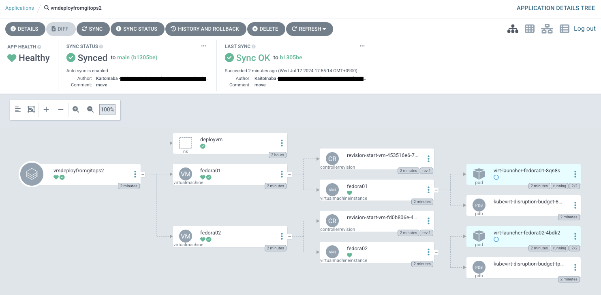

# GitOpsによるVMデプロイのデモ
OpenShift Vitualization + OpenShift GitOpsの極簡単なデモです。
VirtualizationとGitOpsのOperatorをインストールの上、下記のコマンド実行することでArgoCDアプリケーションが設定されます。

```
oc apply -f https://raw.githubusercontent.com/KaitoInaba/ocpv-gitops/main/apps.yaml
```

ArgoCD アプリケーション作成後の状態は下記のようになります。
* ArgoCDアプリケーション `vmdeployfromgitops` が作成されます
* Project `deployvm` が作成されます
* 上記のProject配下に2台のVM(`fedora01`,`fedora02`)が作成されます



## ご留意事項
* まっさらな環境でクイックにデプロイできることを優先しているため、VMのrootdiskはContainer Storageを指定しています = Ephemeralストレージのため再起動ごとに初期状態に戻ります。
  実使用時は[PVC のクローン作成による仮想マシンの作成](https://docs.redhat.com/ja/documentation/openshift_container_platform/4.15/html/virtualization/creating-vms-from-custom-images#virt-creating-vms-by-cloning-pvcs)などにより永続ストレージをご指定ください。